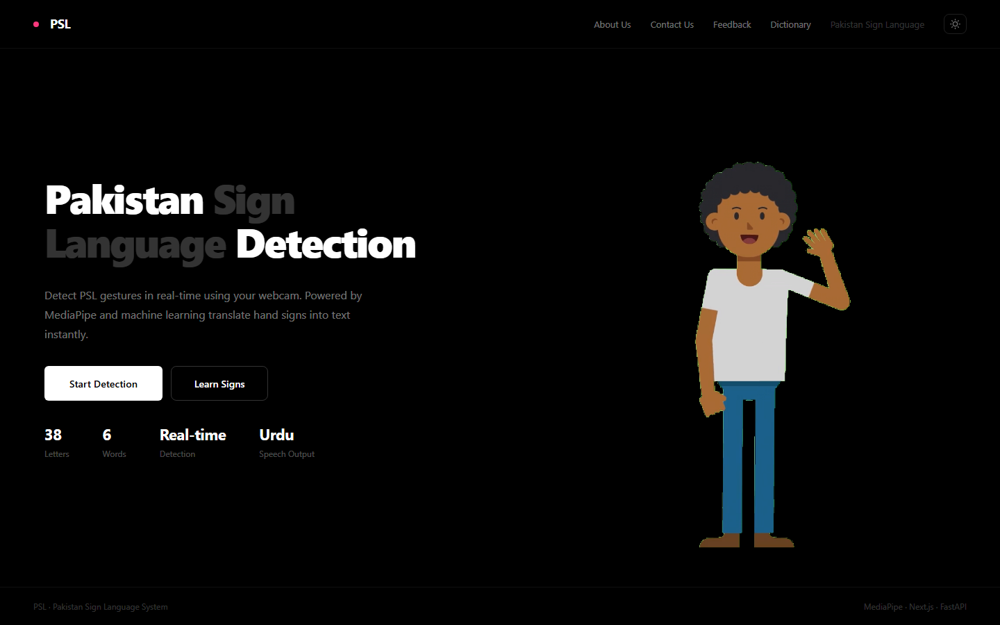
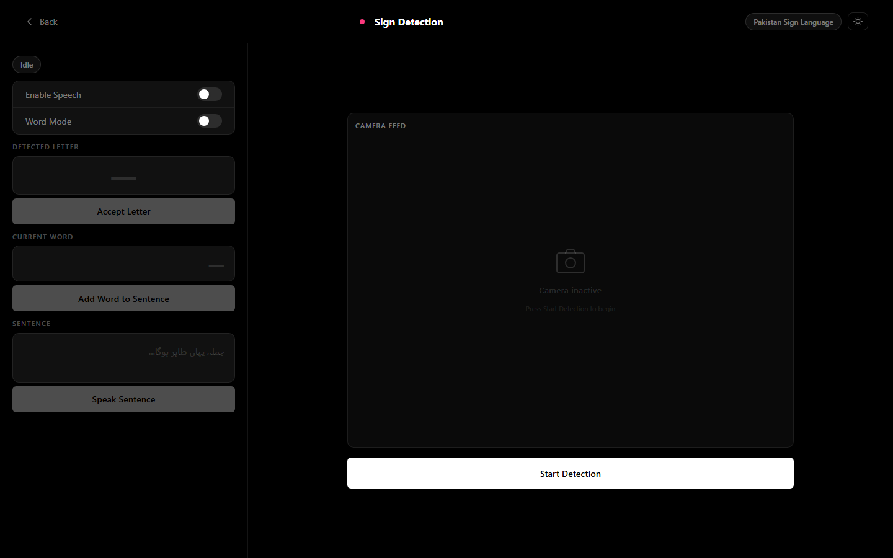

# Pakistan Sign Language Detection System — Classic UI

An earlier iteration of [LinguaSign](https://github.com/waqaswajla/pakistan-sign-language-detection-system) — the same PSL detection engine (MediaPipe + TensorFlow), with the original, simpler dark/pink UI from before the LinguaSign rebrand (redesigned UI, Google sign-in, dashboard, quiz mode, donations, etc.).

This snapshot is kept for reference — to show the project's design evolution — and as a lighter-weight version for anyone who wants the core detector without the full learning-platform features.

**Looking for the actively maintained, full-featured version? Go to [pakistan-sign-language-detection-system](https://github.com/waqaswajla/pakistan-sign-language-detection-system).**





---

## What's included

- **Real-time detection** — recognizes 38 PSL alphabet letters via webcam
- **Sentence builder** — accept letters → build words → compose full sentences
- **Urdu speech output** — pre-recorded audio or browser TTS fallback
- **Word mode** — switch between letter-by-letter and full-word detection
- **Learn page** — browse PSL letters with hand-sign images
- **Dictionary** — searchable reference for letters and words
- **Contact & Feedback pages**

Not included here (see the main repo instead): Google sign-in, dashboard/streaks, live quiz mode, donations, the "How It Works" explainer, and the LinguaSign visual redesign.

---

## Tech Stack

| Layer | Technology |
|-------|-----------|
| Frontend | Next.js 16, TypeScript |
| Backend | FastAPI, Python 3.9–3.11 |
| ML / CV | MediaPipe, TensorFlow / Keras, scikit-learn, OpenCV |
| Speech | Pre-recorded Urdu audio + Web Speech API fallback |

---

## Getting Started

### Prerequisites

- Python 3.9–3.11 (TensorFlow/MediaPipe don't yet support 3.12+)
- Node.js 18+
- A webcam

### 1. Clone the repository

```bash
git clone https://github.com/waqaswajla/pakistan-sign-language-detection-system-classic-ui.git
cd pakistan-sign-language-detection-system-classic-ui
```

### 2. Set up the backend

```bash
cd backend
python -m venv venv

# Windows
venv\Scripts\activate
# macOS / Linux
source venv/bin/activate

pip install -r requirements.txt
uvicorn main:app --reload --host 127.0.0.1 --port 8000
```

### 3. Set up the frontend

Open a new terminal:

```bash
cd frontend
npm install
npm run dev
```

### 4. Open the app

Visit [http://localhost:3000](http://localhost:3000).

---

## How to Use

1. Open the app and click **Start Detection**
2. Allow camera access when prompted
3. Make a PSL hand sign in front of your webcam
4. The detected letter appears in the **Detected Letter** panel
5. Click **Accept Letter** to add it to your current word
6. Click **Add Word to Sentence** once a word is complete
7. Use **Speak Sentence** to hear the output in Urdu
8. Toggle **Word Mode** to detect full words directly

---

## API Endpoints

| Method | Endpoint | Description |
|--------|----------|-------------|
| `POST` | `/api/start-capture` | Open webcam and begin frame capture |
| `POST` | `/api/stop-capture` | Release webcam |
| `POST` | `/api/match` | Run detection on current frame, return label |
| `GET` | `/api/stream` | MJPEG live video stream |
| `GET` | `/audio/{word}.mp3` | Serve Urdu audio file for a word |

---

## Model Details

Dense neural network trained on MediaPipe hand keypoints — 42 features per frame (21 landmarks × XY), standardised with a `StandardScaler`, classifying 38 PSL alphabet classes. Trained models (`.h5`/`.pkl`) and the extracted keypoint dataset (`main_dataset.db`) are included so the app runs out of the box; raw source images are kept private (see the main repo's README for why).

---

## Project Docs

- [`docs/final-presentation.pptx`](docs/final-presentation.pptx) — final FYP defense presentation
- [`docs/fyp-logics.docx`](docs/fyp-logics.docx) — design/logic notes written during development

---

## License

This project is licensed under the [MIT License](LICENSE).

Copyright (c) 2026 Waqas Ahmed

---

## Author

**Waqas Ahmed** — [waqaswajla](https://github.com/waqaswajla)

For any queries, reach out at wow.992du@gmail.com or +92 300 0700908.
